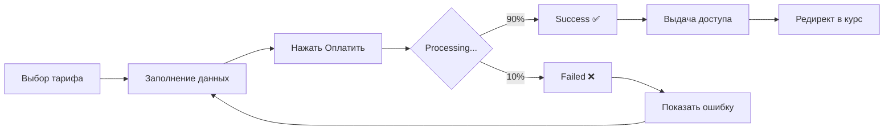

# 🎓 Dimel's School - Educational IT Platform MVP

> Образовательная платформа для обучения программированию с нуля до трудоустройства


---

## 🚀 Быстрый старт

```bash
npm install
npm run dev
```

Откройте http://localhost:5173

**Тестовый аккаунт:**
- Email: `admin@test.com` (admin) или любой другой (student)
- Password: любой

📖 **[Полный Quick Start Guide →](./QUICK_START.md)**

---

## 📋 Что это?

Dimel's School - это MVP онлайн-школы программирования с полным циклом:
- 🎯 Регистрация и вход
- 💳 Покупка курса (разовая или подписка)
- 📚 Обучение с отслеживанием прогресса
- 👨‍💼 Админская панель для управления

### Основные возможности

✅ **Для студентов:**
- Просмотр информации о курсе
- Покупка курса (2 варианта оплаты)
- Прохождение уроков с видео
- Отслеживание прогресса (%)
- Система достижений
- Личный кабинет с статистикой

✅ **Для админов:**
- Панель управления с метриками
- Управление пользователями
- История платежей
- Редактирование курса

---

## 📂 Документация

### Для начала работы
- **[🚀 QUICK_START.md](./QUICK_START.md)** - Запуск за 30 секунд
- **[✅ CHECKLIST.md](./CHECKLIST.md)** - Проверка перед демо

### Для понимания проекта
- **[📖 MVP_README.md](./MVP_README.md)** - Полное описание MVP
- **[📊 SUMMARY.md](./SUMMARY.md)** - Итоговая сводка

### Для разработчиков
- **[🛠 DEVELOPMENT.md](./DEVELOPMENT.md)** - Гайд по разработке
- **[🎬 USER_SCENARIOS.md](./USER_SCENARIOS.md)** - Пользовательские сценарии

---

## 🎯 Реализованные сценарии

### 1. Новый студент
```
Регистрация → Личный кабинет → Покупка курса → 
Оплата → Получение доступа → Обучение → Прогресс
```

### 2. Returning студент
```
Вход → Личный кабинет → Продолжить обучение → 
Завершить урок → Обновление прогресса → Достижения
```

### 3. Администратор
```
Вход → Админка → Управление пользователями → 
Просмотр платежей → Редактирование курса
```

---

## 🛠 Технологии

| Категория | Технология |
|-----------|-----------|
| Frontend | React 18, TypeScript |
| Routing | React Router 7 |
| Styling | Tailwind CSS 4 |
| Icons | Lucide React |
| State | Context API |
| Build | Vite |

---

## 📱 Структура приложения

```
/                        → Лендинг + Регистрация/Вход
/dashboard               → Личный кабинет студента
/course/:id              → Страница курса с уроками
/purchase                → Покупка курса
/admin                   → Админ панель
  /admin/users           → Управление пользователями
  /admin/payments        → История платежей
  /admin/course          → Редактирование курса
```

---

## 🎨 Ключевые фичи

### 💳 Система оплаты
- Разовая оплата ($299)
- Ежемесячная подписка ($59/мес)
- 3 состояния: pending → success/failed
- Автоматическая выдача доступа
- Mock payment processing

### 📊 Отслеживание прогресса
- Автоматический подсчет % завершения
- Последовательная разблокировка уроков
- Сохранение текущего урока
- История завершенных уроков

### 🏆 Система достижений
- Разблокируются по мере прогресса
- Визуальные бейджи
- 4 уровня достижений

### 👨‍💼 Админка
- Статистика платформы
- Управление доступом пользователей
- Фильтрация и поиск
- Редактор структуры курса

---

## 🔐 Роли пользователей

### Student (Студент)
- Доступ к курсу (после покупки)
- Личный кабинет
- Отслеживание прогресса

### Admin (Администратор)
- Все возможности студента +
- Админская панель
- Управление пользователями
- Управление курсом
- Просмотр платежей

---

## 📊 Данные курса

### Full Stack Web Development
- **Модулей:** 4
- **Уроков:** 16
- **Длительность:** 6 месяцев
- **Цена:** $299 (one-time) / $59 (monthly)

**Модули:**
1. Основы HTML & CSS (4 урока)
2. JavaScript Основы (4 урока)
3. React Fundamentals (4 урока)
4. Backend с Node.js (4 урока)

---

## 🎨 UI States

### Для неавторизованных
- Лендинг с формой входа/регистрации
- Превью курсов
- Информация о платформе

### Для студентов без доступа
- Баннер "Купить курс"
- Locked уроки
- CTA кнопки везде

### Для студентов с доступом
- Разблокированные уроки
- Прогресс бары
- Статистика обучения

### Для админов
- Полный доступ ко всему
- Дополнительная админ панель

---

## 🔄 Payment Flow



---

## 🐛 Dev Tools

### DevHelper
В правом нижнем углу (только dev режим):
- Показывает состояние пользователя
- Быстрая выдача доступа
- Быстрый logout
- Информация о тестовых аккаунтах

⚠️ **Удалить перед production!**

---

## ✅ MVP Checklist

Что реализовано в v1.0:

- [x] Регистрация/Вход
- [x] Личный кабинет
- [x] Страница курса
- [x] Система покупки
- [x] Обработка платежей (mock)
- [x] Отслеживание прогресса
- [x] Админская панель
- [x] Управление пользователями
- [x] История платежей
- [x] Редактор курса
- [x] Locked/Unlocked состояния
- [x] Достижения
- [x] Адаптивный дизайн
- [x] 404 страница

---

## 🚧 Не реализовано (TODO v2.0)

### Backend
- [ ] Настоящая база данных
- [ ] JWT authentication
- [ ] Реальная payment интеграция
- [ ] Webhook processing
- [ ] Email сервис

### Features
- [ ] Видео-плеер (настоящий)
- [ ] Загрузка файлов
- [ ] Тесты к урокам
- [ ] Чат с преподавателем
- [ ] Генерация сертификатов
- [ ] Восстановление пароля

---

## 📝 Примечания для разработчиков

### Mock данные
- **Аутентификация:** localStorage
- **Курс:** статичный объект
- **Платежи:** setTimeout (2 сек)
- **Прогресс:** localStorage

### API endpoints (для backend)
Смотри [DEVELOPMENT.md](./DEVELOPMENT.md) для полного списка необходимых endpoints.

### Webhook события
```typescript
payment.success  → Выдача доступа
payment.pending  → Показ статуса
payment.failed   → Показ ошибки
```

---

## 📸 Screenshots

### Лендинг


### Личный кабинет


### Админка


---

## 🎯 Цели MVP

1. ✅ Демонстрация полного user flow
2. ✅ Proof of concept для инвесторов
3. ✅ Тестирование UX с реальными пользователями
4. ✅ Подготовка к backend разработке
5. ✅ Понятный roadmap для v2.0

---

## 👥 Команда

Создано как MVP для онлайн-школы программирования.

---

## 📄 Лицензия

Proprietary - All rights reserved

---

## 🆘 Поддержка

Вопросы по проекту:
- Смотри [DEVELOPMENT.md](./DEVELOPMENT.md)
- Проверь [USER_SCENARIOS.md](./USER_SCENARIOS.md)
- Используй [CHECKLIST.md](./CHECKLIST.md)

---

## 🎉 Статус проекта

**MVP v1.0 COMPLETE!** 🚀

Готово к:
- ✅ Демонстрации
- ✅ UX тестированию
- ✅ Backend интеграции
- ✅ Следующей итерации

---

**Built with ❤️ using React, TypeScript, and Tailwind CSS**
